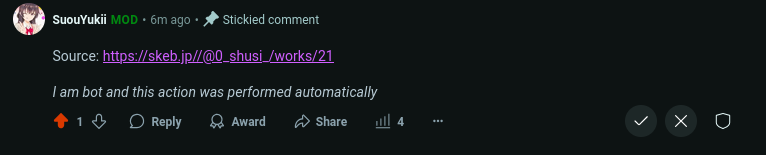

# r/SuouYuki Mod Bot

This is my custom Reddit moderation bot for my subreddit r/SuouYuki. It handles two main tasks automatically:

## What It Does

### Reverse Image Search

- Automatically checks every image post

- Uses SauceNAO API to find the original source

- Posts the source link as a sticky comment

### AI Post Limit Enforcement

- Limits users to 1 AI-flaired post per week

- Automatically removes posts that exceed the limit

- Explains removal reasons with sticky comments

- Tracks user post history for cooldowns

### Preview

## Tech Stack
- Python with [PRAW](https://praw.readthedocs.io/) (Reddit API)
- Flask for health checks
- SauceNAO API for reverse image search

## Setup

    Add these environment variables:

        REDDIT_CLIENT_ID

        REDDIT_CLIENT_SECRET

        REDDIT_USERNAME

        REDDIT_PASSWORD

        REDDIT_USER_AGENT

        SAUCENAO_API_KEY

### Install requirements

`pip install praw flask requests gunicorn`

### Run

`python main.py`

